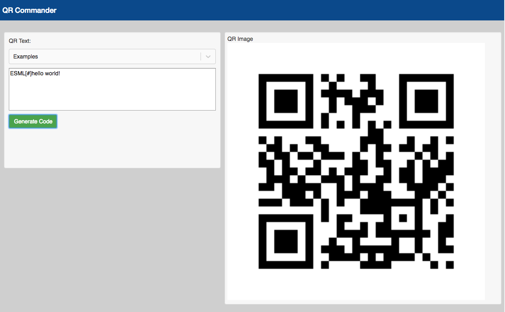

# qr-commander



a react app for generating qr-commander codes for Jibo.

site: [https://wwlib.org/qr-commander/](https://wwlib.org/qr-commander/)

[medium article about qr-commander](https://medium.com/@andrew.rapo/keep-your-jibo-talking-and-dancing-with-qr-commander-e1f418bdac4c)


[https://wwlib.org](https://wwlib.org)

#### install
```
yarn
```

#### web
To develop for the Web and automatically launch a browser window for development...

```
yarn start:web
```

http://localhost:3000/

To build for the Web into the docs folder...

```
yarn build:web
```

#### enabling qr-commander on Jibo
- Jibo software version >= 2.0.0 is required
- use Jibo's menu to enable qr-commander
- show qr-commander-generated codes to Jibo to give him things to say


#### codes
 - must start with `ESML[#]` followed by text or ESML (Embodied Speech Markup Language)
 - see the Examples pulldown for ESML examples


#### app structure
**Medium post:**
<https://medium.com/@andrew.rapo/using-create-react-app-craco-to-build-apps-for-both-the-web-and-electron-8f4ab827877f>

This project was bootstrapped with [Create React App](https://github.com/facebook/create-react-app), like...

`create-react-app cra-craco-electron-example --typescript`

In this project the [\@craco/craco](https://www.npmjs.com/package/@craco/craco) module is used to override the create-react-app default webpack config instructing it to build for the `electron-renderer`. This allows the app to run in electron AND have access to the filesystem, etc. See: `craco.config.electron.js`

```
module.exports = {
    webpack: {
        configure: {
            target: 'electron-renderer'
        }
    }
};
```

#### environment variables

Environment variables are used at runtime to enable/disable features depending on what the browser or Electron supports.

.env.web
```
REACT_APP_NAME=myApp
REACT_APP_MODE=web
```

.env.electron
```
REACT_APP_NAME=myApp
REACT_APP_MODE=electron
```
